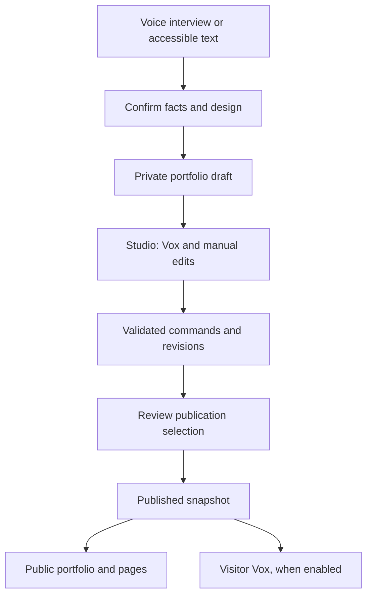

# Voxfolio

### Build a cinematic portfolio by talking to Vox.

[](https://voice-directed-3d-portfolio-builder.vercel.app/) [](https://nextjs.org/) [](https://www.typescriptlang.org/)

**[Try the live product](https://voice-directed-3d-portfolio-builder.vercel.app/)** · **[Build with Vox](https://voice-directed-3d-portfolio-builder.vercel.app/start)** · [Latest release notes](RELEASE_V27_12.md) · [Architecture notes](V26_ARCHITECTURE.md)

Voxfolio turns a conversation about your work into an editable 3D portfolio. Vox interviews you, helps shape the content and design, and assists with supported Studio edits. You confirm exact details before they enter your site and explicitly approve what gets published. A keyboard and text route remains available when voice is unavailable or you prefer it.

> **Built for creators, including people who benefit from voice-led workflows.** Accessibility is a product goal; this repository does not claim an independent accessibility certification.

## Experience Voxfolio

| Create | Refine | Publish |
| :--- | :--- | :--- |
| Speak to Vox, confirm professional details, browse designs and explicitly select one. | Edit content and 3D design in Studio; ask Vox to draft or change supported content. | Review a publication selection and share a public portfolio, article, case study or opportunity page. |

**Demo path:** Open [Build with Vox](https://voice-directed-3d-portfolio-builder.vercel.app/start) → confirm a name or spelling → preview multiple templates → **Confirm this template** → create a private draft → edit in Studio → review and publish. Previewing a template alone does not commit a choice.

## What makes it useful

- **Conversation becomes a site.** The guided interview captures a professional story and assembles a working portfolio.
- **Say it, then verify it.** Exact names and other sensitive details require confirmation. Voice publication requires a separate review and confirmation.
- **One portfolio, several opportunities.** Create independently reviewable versions tailored to an audience while keeping the main portfolio intact.
- **A publishing workflow, not just a homepage.** Case studies, About content, articles, media and SEO metadata accompany the cinematic homepage.
- **A public assistant grounded in the owner's content.** Owners can configure Visitor Vox for published portfolios and manage supporting documents in project settings.

## From conversation to public site



Voice and manual edits use the same validated command pipeline. Supabase stores owner-scoped projects and revisions; publishing creates a separate snapshot for public routes. Visitor Vox draws on eligible published content and configured supporting knowledge.

### Technology map

| Layer | Stack | Role |
| :--- | :--- | :--- |
| Web app | Next.js 15 App Router, React 19, TypeScript | Onboarding, Studio, dashboard and public pages |
| Cinematic scenes | Three.js, React Three Fiber, Drei | Interactive portfolio scenes and designs |
| Voice | AssemblyAI APIs, browser audio worklet | Spoken sessions and live audio |
| Content assistance | Server-side model provider integrations | Intent planning, copy refinement and drafting with validation |
| Identity and data | Supabase Auth, PostgreSQL, row-level security | Projects, revisions, media and publications |
| Editing and contracts | Tiptap, Zod, Vitest | Rich text, input validation and tests |

**Security boundary:** Provider keys and the Supabase service-role key stay on the server. Only settings named `NEXT_PUBLIC_*` are intended for browser exposure. AI and voice functions depend on configured providers and their availability.

## Explore the workspace

| Area | Capabilities |
| :--- | :--- |
| **Creation** | Voice-led interview, exact-field confirmation, repeatable design previews, explicit template selection and private draft creation; accessible keyboard and text route. |
| **Studio** | Edit Hero, About, skills, education, experience, projects, contact, design and 3D scenes; preview changes and use Vox for supported actions. |
| **Editorial** | Write detailed About content, blog articles and case studies using rich text, media, slugs and SEO metadata. |
| **Opportunity pages** | Tailor a separate version of a main portfolio; review source differences and manage sharing or publication independently. |
| **Publishing** | Choose what goes live, review the result and publish versioned snapshots. Private opportunity content cannot be published publicly by accident. |
| **Visitor Vox** | Enable a public portfolio assistant and manage supporting knowledge in project settings. |

Published routes include `/p/[slug]`, `/p/[slug]/blog`, `/p/[slug]/projects` and their article and case-study detail pages.

## Run locally

**Requirements:** Node.js 20.9+, pnpm, a Supabase project and credentials for the provider-backed features you intend to use.

```bash
pnpm install
cp .env.example .env.local
pnpm dev
```

On Windows PowerShell replace `cp` with `Copy-Item .env.example .env.local`. Visit [http://localhost:3000](http://localhost:3000).

Fill `.env.local` using [`.env.example`](.env.example):

| Variable | Purpose |
| :--- | :--- |
| `NEXT_PUBLIC_SUPABASE_URL`, `NEXT_PUBLIC_SUPABASE_ANON_KEY` | Supabase URL and public browser key |
| `SUPABASE_SERVICE_ROLE_KEY` | Server-only privileged Supabase access |
| `ASSEMBLYAI_API_KEY` | Server-only voice sessions |
| `VISITOR_AGENT_HASH_SECRET` | Server-only random secret, at least 32 characters, for Visitor Vox limits |
| `GEMINI_API_KEY`, `OPENAI_API_KEY` | Configure applicable content and extraction providers |
| `NEXT_PUBLIC_SITE_URL` | Local or deployed base URL |

Additional model options are documented in `.env.example`. Never commit `.env.local` or put private keys in `NEXT_PUBLIC_` variables. Apply files in [`supabase/migrations`](supabase/migrations) **in numeric order** to the correct Supabase project, checking which migrations are already applied. The latest included migration is `017_vox_interview_demo_sessions.sql`.

```bash
pnpm typecheck
pnpm test
pnpm lint
pnpm build
```

See [V27.12 release notes](RELEASE_V27_12.md) for the latest hands-on acceptance checks. Run these commands and manual provider/database checks in your configured environment before deploying.

## Repository guide

| Location | Contents |
| :--- | :--- |
| [`src/app/start`](src/app/start) | Voice interview and creation screens |
| [`src/app/studio`](src/app/studio) | Portfolio Studio route |
| [`src/app/projects`](src/app/projects) | Dashboard and project settings |
| [`src/app/p`](src/app/p) | Published portfolio and editorial pages |
| [`src/app/api`](src/app/api) | Project, voice, visitor and content endpoints |
| [`supabase/migrations`](supabase/migrations) | Database schema and publication controls |
| [`RELEASE_V27_12.md`](RELEASE_V27_12.md) | Latest fixes and manual test checklist |

## Product boundaries

- Voice is the featured creation experience; keyboard and text remain available for accessibility and recovery.
- Owners should review AI-assisted writing and confirm exact spellings and publication contents.
- Interview progress is retained in the same browser tab during creation; it does not sync across devices.
- Visitor Vox needs a published portfolio, appropriate credentials and eligible knowledge. Uploading a document does not publish a private draft.

## License

No `LICENSE` file is included in this repository snapshot. Add explicit license terms if you intend to permit reuse or contributions; do not assume the source is open source.

---

**Voxfolio** · [Live product](https://voice-directed-3d-portfolio-builder.vercel.app/) · [Start building](https://voice-directed-3d-portfolio-builder.vercel.app/start) · [Release notes](RELEASE_V27_12.md)
