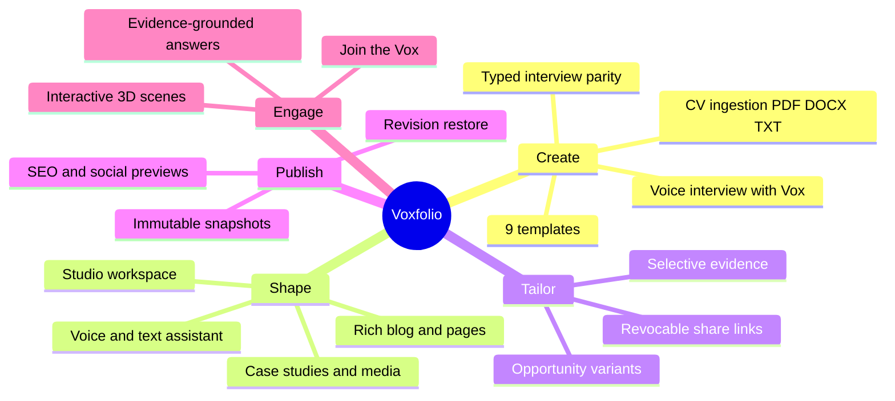
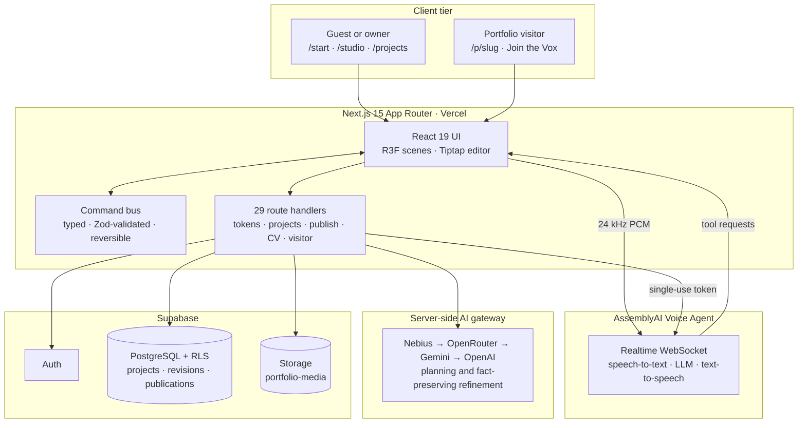
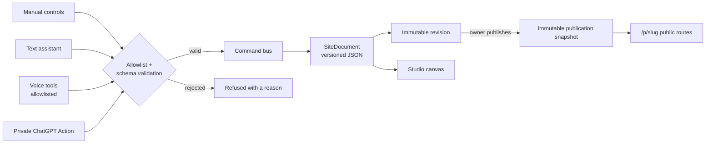
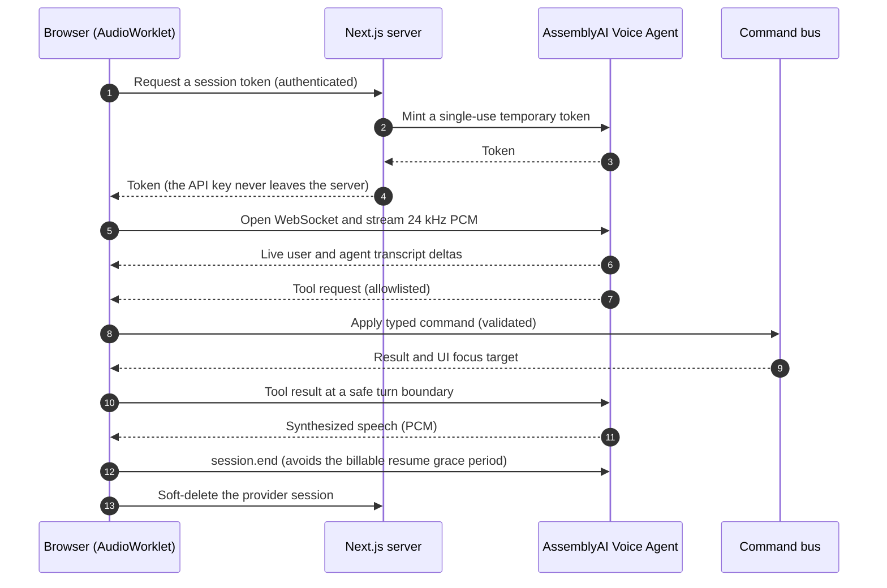
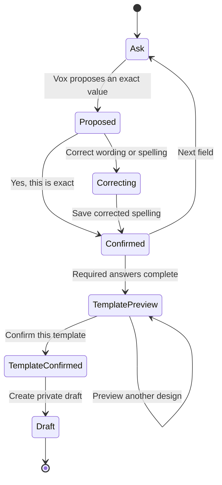
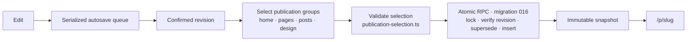
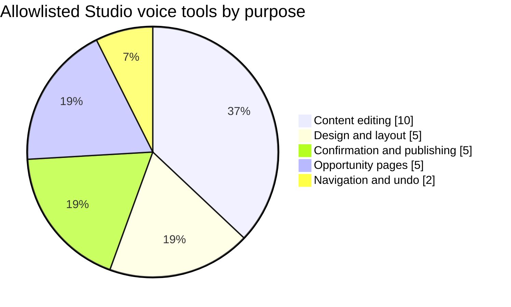

<div align="center">

# Voxfolio

### Build your story. Speak it into shape.

**A voice-directed 3D portfolio builder.** Talk to Vox, watch a cinematic portfolio assemble live, keep refining it in Studio, and publish an immutable public site that visitors can explore, and question, in their own voice.

[](https://nextjs.org)
[](https://react.dev)
[](https://www.typescriptlang.org)
[](https://r3f.docs.pmnd.rs)
[](https://supabase.com)
[](https://www.assemblyai.com)
[](#-testing--verification)
[](https://nodejs.org)
[](https://pnpm.io)

<!--
  ADD AFTER DEPLOY (uncomment and fill in):
  [](https://YOUR-VERCEL-URL)
  [](https://YOUR-VIDEO-URL)
-->

[Overview](#-overview) · [Screenshots](#-screenshots) · [Architecture](#-architecture) · [Features](#-features) · [Quick start](#-quick-start) · [Voice tools](#-voice-tools-reference) · [Roadmap](#-roadmap)

</div>

---

## 📌 Overview

A portfolio should help people understand who you are, explore what you have built, and see how your experience fits an opportunity. Creating and maintaining one is surprisingly heavy work. **Voxfolio makes that process conversational, from the first draft to the details you change later.**

| | |
|---|---|
| **The problem** | Portfolios are built once, drift out of date, and rarely adapt to the opportunity in front of you. Visual, 3D-quality sites usually require a designer or a drag-and-drop builder that assumes you can see and click your way through it. |
| **The approach** | One shared, validated command pipeline. Manual controls, the text assistant, and the AssemblyAI voice agent all change the portfolio through the same typed, reversible commands, so voice is a first-class way to build, not a bolt-on. |
| **The outcome** | Speak your details in a guided interview, refine everything by voice or keyboard in Studio, tailor role-specific versions, publish an immutable site, and let visitors ask it questions through **Join the Vox**. |

> **Built for the [AssemblyAI Voice Agent Hackathon](https://lablab.ai/ai-hackathons/assemblyai-voice-agent-hackathon) on lablab.ai.**

### At a glance

| Metric | Value |
|---|---|
| Source files (`src/`) | **193** files · ~11.9k lines of strict TypeScript / TSX |
| Automated tests | **177** passing at last full verification (V27.10), across 38 test files |
| Allowlisted voice tools | **27** in Studio + **8** in guided onboarding |
| Portfolio templates | **9** content-preserving templates |
| 3D scene families | **4** (Orbital Showcase · Constellation Field · Kinetic Gallery · Velocity Roadster) + a 2D professional family |
| Server route handlers | **29** API routes |
| SQL migrations | **17** ordered migrations with owner-only row-level security |
| Public routes | Portfolio · Projects · Case studies · Blog · Site pages · Shared opportunity links |

---

## 🖼 Screenshots

> Drop PNG files into [`docs/screenshots/`](docs/screenshots/) using the filenames below and they will render here automatically.

<table>
  <tr>
    <td width="50%"><br><sub><b>1 · Guided onboarding</b>: Vox proposes each exact value, the owner confirms, and the preview builds live.</sub></td>
    <td width="50%"><br><sub><b>2 · Studio</b>: live canvas, content editor and Vox in one bounded workspace.</sub></td>
  </tr>
  <tr>
    <td width="50%"><br><sub><b>3 · Templates</b>: preview freely, commit with an explicit confirmation.</sub></td>
    <td width="50%"><br><sub><b>4 · Published portfolio</b>: cinematic 3D hero rendered from an immutable snapshot.</sub></td>
  </tr>
  <tr>
    <td width="50%"><br><sub><b>5 · Blog and pages</b>: structured blocks, SEO guidance and search-result preview.</sub></td>
    <td width="50%"><br><sub><b>6 · Opportunity pages</b>: a focused view of your work for one role or audience.</sub></td>
  </tr>
  <tr>
    <td width="50%"><br><sub><b>7 · Join the Vox</b>: visitors ask questions answered from approved, published evidence.</sub></td>
    <td width="50%"><br><sub><b>8 · Mobile Studio</b>: Canvas · Edit · Vox tabs; the voice session persists across tabs.</sub></td>
  </tr>
</table>

---

## 🧭 Product map



---

## 🏗 Architecture

### System overview



### One command pipeline for every input

Every visible change is a **typed command applied to a validated site document**. No input channel can touch the Three.js scene, the DOM, or generated source code directly.



### Voice session lifecycle



### Guided onboarding: exact-value confirmation

Voice recognition can mis-hear names and institutions, so Vox **never saves a critical value on a single hearing**. It proposes the exact value, the owner confirms it or types a correction, and only then does the interview advance.



### Save and publish chain



---

## ✨ Features

### 🎙 Voice-directed creation and editing

- **Guided interview with Vox** at `/start`: name, role, introduction, skills, purpose, template and first project, each confirmed before it is saved.
- **Exact-value guardrail** for names, employers, institutions, titles and URLs, with an explicit *Correct wording or spelling* path.
- **Multi-action requests**: several ordered actions from one instruction, each reported individually and undoable.
- **Site-wide replace by voice**: exact-match scan, visible preview of every affected field, a separate approval turn, and a single undoable revision.
- **Voice publishing with read-back**: Vox states the exact target and public URL, then waits for a separate explicit confirmation. Private opportunity pages cannot be published by voice.
- **Live conversation state**: streaming user and agent transcripts, a visible listening / responding indicator, barge-in cleanup and resumable sessions.
- **Synchronized navigation**: spoken or typed requests focus the matching editor *and* the live canvas section.

### 🧱 Studio and content system

| Area | Capabilities |
|---|---|
| **Portfolio sections** | Hero · About · Experience · Education · Skills · Projects · Contact, with ordering and visibility |
| **Case studies** | Role, period, challenge, approach and outcome; media galleries; public routes at `/p/[slug]/projects/[project]` |
| **Pages and blog** | Private drafts, structured blocks (H2–H6, paragraphs, quotes, lists, images), rich text and links, inline block insertion and drag or long-press reordering |
| **SEO** | Editable slugs, excerpts, tags and metadata, with live search-result and canonical-path previews |
| **Media library** | Owner-scoped uploads, alt text, ordered galleries, cover images, headshots and dynamic favicons |
| **Workspace** | Bounded live canvas, resizable panels, expanded desktop editor, and a mobile Canvas · Edit · Vox layout |
| **Revisions** | Immutable project revisions, visual timeline and non-destructive restore |

### 🎨 Templates and 3D scenes

| Template | Character |
|---|---|
| **Cinematic Orbit** | Dark orbital showcase with clickable 3D skill nodes |
| **Architectural Grid** | Structured, editorial grid presentation |
| **Editorial Depth** | Layered, long-form storytelling |
| **Kinetic Gallery** | Non-orbital cinematic gallery with a luminous monolith and pointer-responsive panels |
| **Velocity Atelier** | Daylight automotive showroom built around a roadster |
| **Professional 2D** | Clean, fast, non-WebGL presentation |
| **Rose Studio** | Blush editorial layout for designers and creators |
| **Midnight Bento** | Modular dashboard layout for developers and product builders |
| **Olive Journal** | Journal-style masthead for writers and researchers |

Switching templates **preserves every content field, revision and publication state**. All 3D scenes ship with reduced-motion handling and a static WebGL fallback, and use GPU-light CSS depth instead of a separate WebGL context per section.

### 🎯 Opportunity pages

Tailor your work for a specific role or audience **without touching your canonical portfolio**.

1. Create an opportunity version from **My projects** with a title, audience and brief.
2. Vox creates a separate cloud project at revision zero and records its source revision.
3. Choose exactly which existing case studies to feature.
4. Edit, voice-navigate, review differences against the source, and publish an independent immutable URL.
5. Non-public variants are `noindex`; revocable **Shared links** stay pinned to one immutable publication.

### 🗣 Join the Vox: the visitor experience

- Opt-in per portfolio. Owners approve individual excerpts from an uploaded TXT, MD, PDF or DOCX file (max 2 MB) or typed notes; the original file is never stored.
- Visitors get **evidence-grounded** answers from published content plus approved notes, or an honest *no approved answer* fallback.
- Optional voice via AssemblyAI. Only a published canonical portfolio shows the widget; private variants never do.
- Server-enforced, fail-closed daily limits with pseudonymous hashing.

### 📄 Governed CV ingestion

- PDF, DOCX and TXT up to 5 MB, processed in memory and **not retained**.
- Facts are proposed as unapproved candidates with source excerpts; only checked facts are saved.
- Optional OpenAI layout-aware extraction (`store: false`) with strict structured output and grounding validation, and automatic fallback to the deterministic local parser on any timeout, quota or validation failure.

---

## 🛡 Trust and safety guardrails

| Guardrail | How it is enforced |
|---|---|
| **No invented facts** | Vox must obtain owner-supplied exact wording; it will not invent or calculate ages, years of experience or outcomes. AI refinement is fact-preserving. |
| **Typed commands only** | Every tool maps to an allowlisted, schema-validated command. Arbitrary code, DOM and scene mutation are impossible by construction. |
| **Owner authority** | Media upload, project deletion and unpublishing of private variants remain owner-facing UI actions. |
| **Confirm before commit** | Exact-field edits, site-wide replacements, template choice and publishing each need a separate confirmation step. |
| **Immutable publishing** | Public routes read publication snapshots only. Later drafts and restored revisions stay private until republished. |
| **Optimistic concurrency** | Cross-tab and cross-device saves are revision-checked so one session cannot silently overwrite another. |
| **Row-level security** | Owner-only RLS on projects, drafts and revision history. Published media URLs are intentionally public; the service-role key is never exposed to the browser. |
| **Provider resilience** | Retries, timeouts and ordered fallbacks; local deterministic commands (navigation, undo, exact replace, skills, social links) work without any writing provider. |
| **Rate limits** | Server-enforced, fail-closed limits for onboarding sessions (20 per account per day) and public visitor sessions. |

**Accessibility.** Text and keyboard input reach the same interview and Studio outcomes as voice, so nobody is forced to use a microphone. Screen-reader and keyboard checks are part of every release checklist; formal assistive-technology certification is **not** claimed.

---

## 🧰 Technology map

```
voxfolio/
├── Framework & language
│   ├── Next.js 15 (App Router) ........ routing, server components, route handlers
│   ├── React 19 ....................... UI and concurrent rendering
│   └── TypeScript 5.9 (strict) ........ end-to-end type safety
├── 3D & rendering
│   ├── three 0.180 .................... WebGL engine
│   ├── @react-three/fiber 9 ........... declarative scenes
│   └── @react-three/drei 10 ........... scene helpers
├── Voice & AI
│   ├── AssemblyAI Voice Agent API ..... realtime STT · LLM · TTS over WebSocket
│   ├── AudioWorklet (24 kHz PCM) ...... low-latency mic capture and playback
│   └── AI gateway ..................... Nebius → OpenRouter → Gemini → OpenAI
├── Data & auth
│   ├── Supabase Auth (@supabase/ssr) .. email authentication
│   ├── PostgreSQL + RLS ............... projects · revisions · publications · agent limits
│   └── Supabase Storage ............... owner-scoped portfolio media
├── Content
│   ├── Tiptap 3 ....................... rich-text editing with a restricted schema
│   ├── mammoth · pdf-parse ............ DOCX and PDF extraction
│   └── Zod 4 .......................... validation for commands, documents and API input
└── Quality
    ├── Vitest 3 ....................... domain, voice, publishing and provider tests
    ├── ESLint 9 ....................... lint gate
    └── Bundle-budget check ............ performance guardrail
```

### Voice tool coverage



---

## 🚀 Quick start

**Requirements:** Node.js 20.9+, [pnpm](https://pnpm.io), a Supabase project, and an AssemblyAI API key for voice. Text interview and text Visitor Vox work without the AssemblyAI key.

```bash
git clone https://github.com/<your-username>/<your-repo>.git
cd voice-directed-3d-portfolio-builder
pnpm install
cp .env.example .env.local     # PowerShell: Copy-Item .env.example .env.local
pnpm dev
```

Open <http://localhost:3000> in Chrome or Edge. Microphone access requires HTTPS or `localhost`.

### Environment variables

| Variable | Required | Scope | Purpose |
|---|:---:|:---:|---|
| `ASSEMBLYAI_API_KEY` | for voice | server | Mints single-use voice tokens |
| `NEXT_PUBLIC_SUPABASE_URL` | ✅ | public | Supabase project URL |
| `NEXT_PUBLIC_SUPABASE_ANON_KEY` | ✅ | public | Publishable anon key |
| `SUPABASE_SERVICE_ROLE_KEY` | ✅ | **server only** | Calls protected database functions |
| `VISITOR_AGENT_HASH_SECRET` | ✅ | **server only** | 32+ character secret for pseudonymous daily limits |
| `NEXT_PUBLIC_SITE_URL` | ✅ | public | Deployed origin (needed for share links and the ChatGPT Action schema) |
| `GEMINI_API_KEY` · `GEMINI_CONTENT_MODEL` · `GEMINI_FALLBACK_MODEL` | optional | server | Intent planning and fact-preserving copy refinement |
| `OPENAI_API_KEY` · `OPENAI_CV_MODEL` · `OPENAI_CONTENT_MODEL` · `OPENAI_CV_TIMEOUT_MS` | optional | server | AI CV extraction and recovery provider |
| `NEBIUS_API_KEY` · `NEBIUS_MODEL` | optional | server | Primary gateway provider when configured |
| `OPENROUTER_API_KEY` · `OPENROUTER_MODEL` | optional | server | Secondary gateway provider when configured |

> ⚠️ Never prefix private keys with `NEXT_PUBLIC_`, never commit `.env.local`, and never expose the service-role key. Restart `pnpm dev` after editing environment files.

### Database setup

Run the SQL files in [`supabase/migrations/`](supabase/migrations) **in order** from the Supabase SQL Editor.

<details>
<summary><b>Migration reference (001 → 017)</b></summary>

| # | File | Adds |
|---|---|---|
| 001 | `001_projects.sql` | Projects, owner-only RLS, immutable revisions |
| 002 | `002_publications.sql` | Immutable publication snapshots |
| 003 | `003_revision_restore.sql` | Non-destructive revision restore |
| 004 | `004_portfolio_media.sql` | Portfolio media storage |
| 005 | `005_fix_portfolio_media_policies.sql` | Storage policy corrections |
| 006 | `006_opportunity_variants.sql` | Opportunity variants |
| 007 | `007_private_opportunity_publication_guard.sql` | Private-variant publication guard |
| 008 | `008_opportunity_share_tokens.sql` | Revocable share tokens |
| 009 | `009_professional_memory_agent_events.sql` | Owner-approved memory, metadata-only agent events |
| 010 | `010_agent_activity_controls.sql` | Agent activity controls |
| 011 | `011_selective_opportunity_refresh.sql` | Selective source refresh |
| 012 | `012_opportunity_share_feedback.sql` | Share feedback |
| 013 | `013_public_visitor_agent_limits.sql` | Visitor session limits |
| 014 | `014_private_content_connections.sql` | Private connections and onboarding limits |
| 015 | `015_visitor_documents.sql` | Approved visitor documents |
| 016 | `016_publication_snapshot.sql` | Atomic, revision-verified publication |
| 017 | `017_vox_interview_demo_sessions.sql` | Raises onboarding limit to 20 starts per day |

</details>

### Deploying to Vercel

1. Import the repository and add the environment variables above.
2. Set `NEXT_PUBLIC_SITE_URL` to the deployed origin.
3. Apply all 17 migrations to the **same** Supabase project.
4. Redeploy, then run the manual checks in the latest `RELEASE_V27_*.md` on the deployed URL (not just localhost).

---

## 🧪 Try it yourself

1. Open `/start`, sign in, and press **Talk to Vox**. Grant microphone access and answer the interview aloud.
2. Say a name Vox mishears, then choose **Correct wording or spelling** and watch it wait for your typed correction before moving on.
3. Add two skills, pick a purpose, **preview several templates**, then **Confirm this template** and say *"Create my private draft."*
4. In Studio, try:
   - *"Update my introduction to say that I design accessible digital products for growing teams."*
   - *"Switch the accent to violet."* · *"Use the Kinetic Gallery template."*
   - *"Replace Voxfolio with Voxfolio Studio everywhere."* (review, then confirm)
   - *"Go to the About section."* · *"Undo that change."*
5. Publish, open `/p/your-slug`, and select **Join the Vox** to ask a question your portfolio can answer.

Voice can draft and edit factual content and reorder work, but it will not upload assets, run arbitrary code, or invent professional facts.

---

## 🗺 Routes

| Route | Purpose |
|---|---|
| `/` | Session-aware homepage and no-account demo |
| `/start` | Guided creation (voice or typed) and template selection |
| `/login` · `/claim` | Authentication and guest-draft claiming |
| `/projects` · `/projects/[id]/settings` | Saved work, publication state and settings |
| `/studio/[projectId]` | Cloud-saved Studio workspace |
| `/p/[slug]` | Published portfolio |
| `/p/[slug]/projects` · `/projects/[project]` | Projects index and case studies |
| `/p/[slug]/blog` · `/blog/[post]` | Blog index and articles |
| `/p/[slug]/pages/[page]` | Standalone site pages |
| `/s/[token]/…` | Revocable shared opportunity link |

---

## 🎙 Voice tools reference

<details>
<summary><b>Guided onboarding tools (8)</b></summary>

`propose_exact` · `confirm_exact` · `set_direction` · `choose_template` · `confirm_template` · `skip_optional` · `skip_project` · `create_private_draft`

</details>

<details>
<summary><b>Studio tools (27)</b></summary>

| Purpose | Tools |
|---|---|
| Content editing | `update_text_content` · `manage_project` · `manage_skill` · `manage_experience` · `manage_education` · `manage_social_link` · `manage_content_block` · `manage_page_or_post` · `summarize_projects` · `focus_skill` |
| Design and layout | `set_color_theme` · `set_hero_layout` · `set_portfolio_template` · `set_scene_style` · `set_section` |
| Confirmation and publishing | `confirm_exact_edit` · `review_site_replace` · `confirm_site_replace` · `review_publication` · `confirm_publication` |
| Opportunity pages | `create_opportunity_variant` · `manage_opportunity_variant` · `manage_opportunity_shares` · `compare_opportunity_source` · `accept_opportunity_source_changes` |
| Navigation and safety | `navigate_to` · `undo_last_change` |

</details>

---

## 📁 Project structure

```
voice-directed-3d-portfolio-builder/
├── src/
│   ├── app/                      # App Router pages and 29 route handlers
│   │   ├── start/                # Guided interview and template selection
│   │   ├── studio/[projectId]/   # Studio workspace
│   │   ├── p/[slug]/             # Public portfolio, blog, pages, case studies
│   │   ├── s/[token]/            # Shared opportunity links
│   │   └── api/                  # assemblyai · assistant · content · cv · projects · visitor · connect
│   ├── domain/                   # 43 files: documents, commands, publishing, templates, opportunities
│   ├── features/
│   │   ├── voice/                # AssemblyAI client, tools, local assistant, task context
│   │   ├── studio/               # Studio panels, reducer, draft-save queue
│   │   ├── scene/                # Orbital, Constellation, Kinetic Gallery, Velocity Roadster
│   │   ├── public/               # Public renderers and Visitor Vox
│   │   ├── portfolio/            # Template-specific section compositions
│   │   └── content/              # Rich-text and block editing
│   └── lib/                      # Providers, Supabase clients, visitor evidence and rate limits
├── supabase/migrations/          # 001 → 017
├── public/pcm-processor.js       # AudioWorklet PCM processor
├── scripts/check-bundle-budget.mjs
├── RELEASE_V*.md                 # Per-release notes and manual acceptance checks
├── ROADMAP.md · V26_ARCHITECTURE.md
└── docs/screenshots/             # README images
```

---

## 🧪 Testing & verification

```bash
pnpm typecheck      # strict TypeScript
pnpm lint           # ESLint
pnpm test           # Vitest
pnpm build          # production build
pnpm check:bundle   # bundle-budget guard
```

Coverage spans reversible commands, database/local revision divergence, edits arriving during a save, failed-save retry, selective and first-time publication, legacy rich-text migration, safe public rendering, voice conversation and onboarding state, site-wide replace, opportunity planning and review, provider fallback, and visitor evidence limits.

The last complete automated run (V27.10) passed **177 tests** with a clean strict type-check. Authenticated runtime behavior, live provider quota, Supabase migrations and microphone flows are validated through the manual acceptance checklists in each `RELEASE_V*.md`; they cannot be inferred from compilation alone.

---

## 🔌 AssemblyAI integration notes

- The server mints a **single-use token** immediately before each connection; the API key stays server-side.
- The browser streams **24 kHz PCM** from an AudioWorklet and plays back synthesized PCM.
- Tool results return only at a **safe turn boundary**; interruption cleanup prevents stale audio.
- Ending a session sends `session.end` before closing, then the app asks its server to soft-delete the provider session.
- If the browser or network drops before that request completes, deletion cannot be guaranteed, so production deployments should add a scheduled server-side cleanup job.
- Provider rejections, application limits and missing database setup produce distinct, actionable messages.

---

## 🧭 Roadmap

| Stage | Milestones |
|---|---|
| **Foundation** (V1–V8) | Typed commands, 3D scenes, voice operation, authentication, CV grounding, design interview, immutable publishing, revision recovery |
| **Content platform** (V9–V15) | Full portfolio model, case studies and media, pages and blog, templates, Studio workspace, direct publishing |
| **Distinct presentations** (V16–V18, V25) | Kinetic Gallery, Velocity Atelier, Rose Studio, Midnight Bento, Olive Journal |
| **Synchronized agent** (V19–V21) | Voice and text parity, Gemini planning, opportunity variants, configurable provider gateway |
| **Delivery and trust** (V22–V26) | Public sitemap and social images, shared links, Visitor Vox, ChatGPT Actions, selective publishing |
| **Voice-first onboarding** (V27.x) | Conversational interview, exact-value confirmation, multi-action commands, site-wide replace, mobile workspace, template preview and confirmation |
| **Next** | Scheduled provider-session cleanup, retention cleanup for media, broader structured data, assistive-technology certification pass, subscription plans |

See [`ROADMAP.md`](ROADMAP.md) for the full milestone history and versioning rules.

---

## 📄 License

**Copyright © 2026 Sufian Mustafa. All rights reserved.**

The source is published for review and evaluation. No permission is granted to copy, modify, host or redistribute it without written consent.

<!-- To open-source instead, replace this section with your chosen license (for example MIT) and add a LICENSE file at the repository root. -->

### Third-party services

Voxfolio integrates AssemblyAI, Supabase, Vercel and optional Google Gemini, OpenAI, Nebius and OpenRouter APIs. Each is governed by its own terms and pricing, and voice usage consumes the operator's AssemblyAI account allowance.

---

## 👤 Author

**Sufian Mustafa**: Digital Growth and AI Search Systems Architect, full-stack web engineer.

[sufianmustafa.com](https://sufianmustafa.com) · [doitwithai.tools](https://doitwithai.tools) · [lionxeframework.com](https://lionxeframework.com)

<div align="center">

**Voxfolio. Build your story. Speak it into shape.**

</div>
